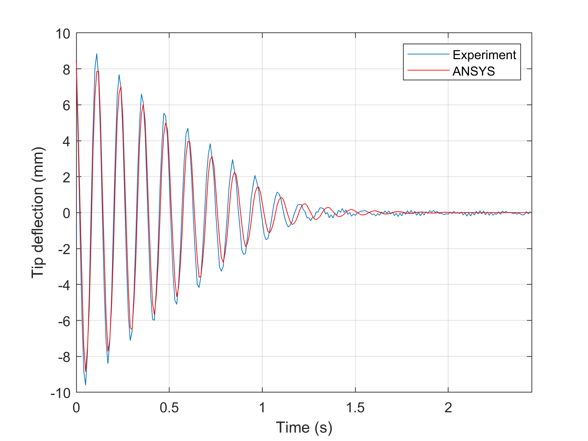

# Active Vibration Control in ANSYS

## Description

This code collection implements the active vibration control of a cantilever beam by piezoceramic actuators and using linear quadratic (LQ) control. The example is coded in the ANSYS-specific APDL (Ansys Parameteric Design Language), including the algorithms for closed-loop control.

## Features

- Implements a 3D transient vibration analysis in ANSYS APDL
- Simulates piezoceramic actuators
- Contains the linear quadratic feedback algorithm entirely in APDL
- The example has been verified experimentally, the collection contains laboratory data.

## Usage
Launch the `start.mac` macro in your ANSYS installation. Comment the control part to compare with open-loop behavior. The beam tip deformation is plotted in ANSYS, and the responsce can also be visualized as an animation. Results will be saved to the `results.csv' file, then the data can be plotted in MATLAB by launching the `process.m' script. The 'control.m' script computes LQ gain and illustrates the estimatior in action. The file 'experiment.mat' contains experimental measurements. Code functionality last verified in ANSYS Mechanical APDL 19.0.

## Screenshots

## Further reading
- TAKÁCS, Gergely - ROHAĽ-ILKIV, Boris. Direct closed-loop active vibration control system prototyping in ANSYS. In NOVEM 2012. Noise and vibration: Emerging Methods : proceedings of the conference. Sorrento, Italy, 1.-4. 4. 2012. Napoli : Universita degli Studi di Napoli "Federico II", 2012, s.001-1 - 001-12. ISBN 9788890648403.

- TAKÁCS, Gergely - ROHAĽ-ILKIV, Boris. Model Predictive Vibration Control: Efficient Constrained MPC Vibration Control for Lightly Damped Mechanical Structures. 1st. ed. London: Springer Verlag London, 2012. 512 s. ISBN 978-1-4471-2332-3. Monograph.

- [Simulation results in a video](https://www.youtube.com/watch?v=CK1lnqwgnOg)

